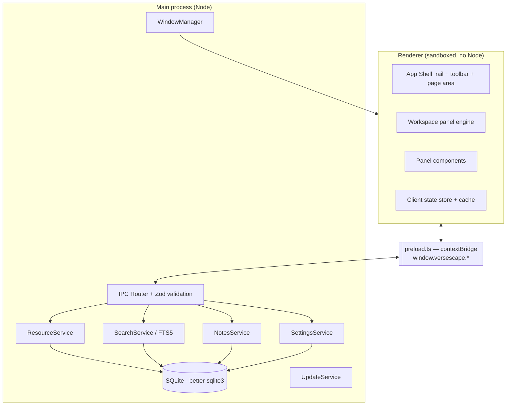

# 02 — Architecture

## Process model



### Rules

- **Renderer never touches Node, `fs`, or the DB.** All privileged work is an IPC call.
- Preload exposes a **narrow, explicitly enumerated** API surface via `contextBridge`.
  No generic `invoke(channel, args)` passthrough.
- Every IPC payload is validated in main with a Zod schema before use. Invalid →
  reject, log, no throw across the bridge with internals attached.
- Heavy work (indexing, import, export) runs in a **utility process** or worker
  thread so the main process stays responsive.

## Layers

| Layer           | Location                 | Responsibility                                    |
| --------------- | ------------------------ | ------------------------------------------------- |
| Shell           | `src/renderer/shell`     | Frameless chrome, rail, toolbar, page routing     |
| Workspace       | `src/renderer/workspace` | Split tree, tab groups, drag/drop, persistence    |
| Panels          | `src/renderer/panels/*`  | One folder per panel type, self-registering       |
| Client services | `src/renderer/services`  | Typed wrappers over `window.versescape`, caching  |
| Bridge          | `src/preload`            | `contextBridge` surface + shared TS types         |
| Domain          | `src/main/domain`        | Reference model, parsing, versification, ranges   |
| Services        | `src/main/services`      | Resource, Search, Notes, Settings, Plans, Update  |
| Persistence     | `src/main/db`            | SQLite access, migrations, repositories           |
| Platform        | `src/main/platform`      | Window controls, paths, single-instance, protocol |

`src/shared` holds pure, dependency-free code usable by both sides: types,
reference parsing/formatting, canonical book list, IPC contract schemas.

## Panel registry

A panel type registers a descriptor; the workspace engine only knows the
descriptor, never the concrete component.

```ts
interface PanelDescriptor<TState = unknown> {
  type: string; // 'bible' | 'notes' | ...
  title: (s: TState) => string; // tab label
  icon: string;
  component: React.ComponentType<PanelProps<TState>>;
  createState: (init?: Partial<TState>) => TState;
  serialize: (s: TState) => JsonValue; // for layout persistence
  deserialize: (j: JsonValue) => TState;
  linkable?: boolean; // participates in reference link sets
  commands?: PanelCommand[]; // contributed to command palette + toolbar
}
```

Adding a panel type = one folder + one registry entry. No shell changes.

## Reference link sets

- A link set has an id, a colour, and a current `ReferenceRange`.
- A panel opts in to at most one link set.
- When a linkable panel navigates, it publishes to its set; other members
  resolve that reference into their own versification and navigate.
- Publishing is debounced and loop-guarded by originator id.

## Custom protocol

Resources are served to the renderer over a registered `versescape://` scheme
handled in main. Benefits: no `file://` access from the renderer, streaming of
large assets, and per-request authorisation against the enabled-resource list.

## Error handling

- Main: structured logger (`electron-log`) with rotating files under `logs/`.
- Renderer: React error boundary per panel — one broken panel must not take
  down the workspace; the tab shows a recoverable error state.
- Crash reporting is **opt-in only** and off by default.

## Threading / performance notes

- Bible text rendering uses windowed virtualisation keyed by verse id.
- Search runs in the utility process against SQLite FTS5, streaming results.
- Layout persistence is debounced (~500 ms) and written atomically.
