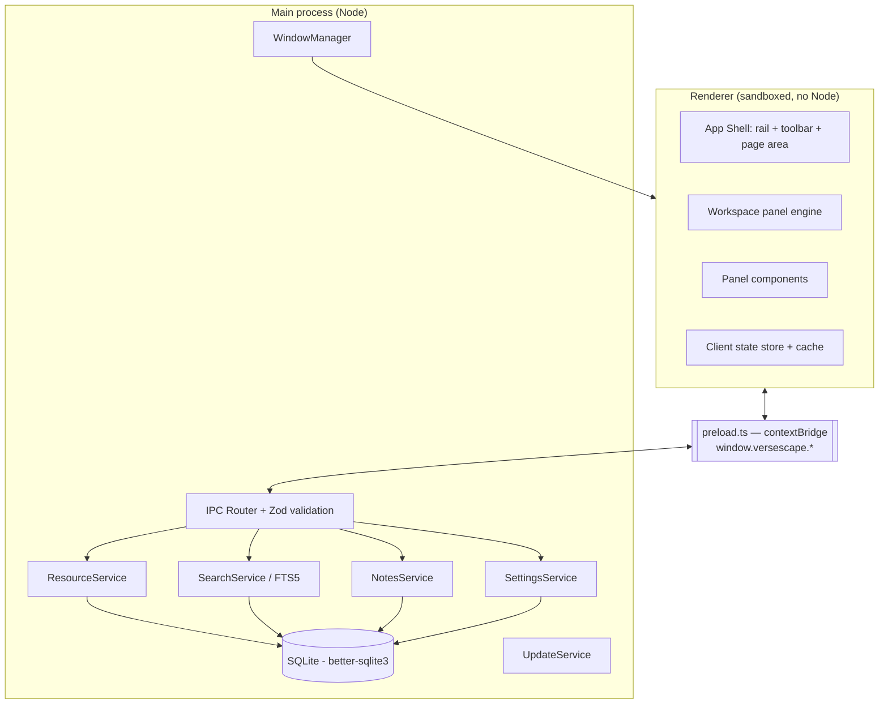

# 02 — Architecture

## Process model



### Rules

- **Renderer never touches Node, `fs`, or the DB.** All privileged work is an IPC call.
- Preload exposes a **narrow, explicitly enumerated** API surface via `contextBridge`.
  No generic `invoke(channel, args)` passthrough.
- Every IPC payload is validated in main with a Zod schema before use. Invalid →
  reject, log, no throw across the bridge with internals attached.
- Heavy work (indexing, import, export) runs in a **utility process** or worker
  thread so the main process stays responsive.

## Layers

| Layer           | Location                 | Responsibility                                    |
| --------------- | ------------------------ | ------------------------------------------------- |
| Shell           | `src/renderer/shell`     | Frameless chrome, rail, toolbar, page routing     |
| Workspace       | `src/renderer/workspace` | Split tree, tab groups, drag/drop, persistence    |
| Panels          | `src/renderer/panels/*`  | One folder per panel type, self-registering       |
| Client services | `src/renderer/services`  | Typed wrappers over `window.versescape`, caching  |
| Bridge          | `src/preload`            | `contextBridge` surface + shared TS types         |
| Domain          | `src/main/domain`        | Reference model, parsing, versification, ranges   |
| Services        | `src/main/services`      | Resource, Search, Notes, Settings, Plans, Update  |
| Persistence     | `src/main/db`            | SQLite access, migrations, repositories           |
| Platform        | `src/main/platform`      | Window controls, paths, single-instance, protocol |

`src/shared` holds pure, dependency-free code usable by both sides: types,
reference parsing/formatting, canonical book list, IPC contract schemas.

## Panel registry

A panel type registers a descriptor; the workspace engine only knows the
descriptor, never the concrete component.

```ts
interface PanelDescriptor<TState = unknown> {
  type: string; // 'bible' | 'notes' | ...
  title: (s: TState) => string; // tab label
  icon: string;
  component: React.ComponentType<PanelProps<TState>>;
  createState: (init?: Partial<TState>) => TState;
  serialize: (s: TState) => JsonValue; // for layout persistence
  deserialize: (j: JsonValue) => TState;
  linkable?: boolean; // participates in verse sync sets
  commands?: PanelCommand[]; // contributed to command palette + toolbar
}
```

Adding a panel type = one folder + one registry entry. No shell changes.

## Sync sets

- Four sets, A/B/C/D, each with a colour. A panel opts in to at most one.
- When a linkable panel moves to a verse — by scrolling, navigating, clicking
  or selecting — it publishes to its set; other members resolve the verse into
  their own versification and move to it.
- Anchoring is on the verse at the viewport top rather than a scroll
  percentage (FR-WS-14). Linkable panel types therefore implement
  `getAnchorVerse()`, `scrollToVerse()` and `covers()` as part of the panel
  contract.
- Publishing is throttled to animation frames and loop-guarded by originator
  id; programmatic scrolls are tagged so they never re-publish.
- Sync sets live entirely in the renderer. They are view state, not user data,
  and are persisted only as part of the workspace layout.

## Custom protocol

Resources are served to the renderer over a registered `versescape://` scheme
handled in main. Benefits: no `file://` access from the renderer, streaming of
large assets, and per-request authorisation against the enabled-resource list.

Structured Bible data does **not** travel through the protocol. Chapter reads
use the validated `resource:get-chapter` IPC contract and return typed verse,
heading and footnote rows. `versescape://resource/<id>/<asset>` is reserved for
streamed assets. Its handler accepts resource ids rather than paths, rejects
encoded separators and traversal, and realpath-checks every asset under the
installed resource's `assets/` directory. M3 authorises installed bundled
resources; M6's enable/disable state narrows that to the enabled-resource list.

## Error handling

- Main: structured logger (`electron-log`) with rotating files under `logs/`.
- Renderer: React error boundary per panel — one broken panel must not take
  down the workspace; the tab shows a recoverable error state.
- Crash reporting is **opt-in only** and off by default.

## Threading / performance notes

- Bible and commentary rendering uses a sliding, windowed chapter buffer keyed
  by verse id. Near either boundary it prefetches the adjacent chapter within
  the book; old chapters may be evicted outside the window. Prepending a chapter
  restores the prior top verse and pixel offset after measurement, so the
  viewport never jumps. The top visible verse remains available in constant
  time for sync publication (FR-RD-03, D-30).
- Search runs in the utility process against SQLite FTS5, streaming results.
- Layout persistence is debounced (~500 ms) and written atomically.
