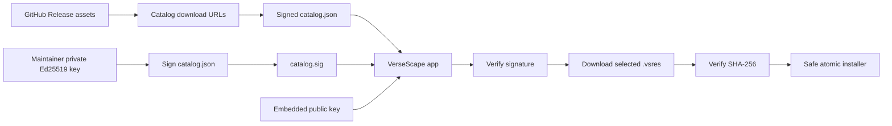

# 15 - Signed Resource Catalog Runbook

## Purpose

This runbook describes how VerseScape publishes and verifies downloadable resource packages. It implements the M6 trust model:

- Resource packages are hosted as GitHub Release assets.
- A signed catalog lists trusted package metadata and download URLs.
- VerseScape ships with the catalog's Ed25519 public key and rejects catalogs whose detached signature does not verify.
- Every downloaded `.vsres` package is checksum-verified and installed atomically by the same safe import path used for local imports.

The catalog signature establishes trust. HTTPS, GitHub, and the catalog URL are transport and availability mechanisms, not the trust boundary.

## Architecture



## One-Time Maintainer Setup

### 1. Choose Hosting

Use GitHub Releases for package assets and the catalog release. This is the recommended v1 arrangement because release assets are versioned and immutable in normal project use.

- Repository: `kelmankenberg/VerseScape`
- Release tag example: `resources-v1`
- Catalog asset: `catalog.json`
- Detached signature asset: `catalog.sig`
- Resource assets: `mhcc-1.0.0.vsres`, `jfb-1.0.0.vsres`, and future packages.

The application should fetch the catalog and signature from the selected release rather than from a mutable branch URL.

### 2. Generate an Ed25519 Key Pair

Generate this once on a trusted maintainer machine:

```bash
openssl genpkey -algorithm ED25519 -out versescape-catalog-private.pem
openssl pkey -in versescape-catalog-private.pem -pubout -out versescape-catalog-public.pem
```

Rules for the private key:

- Never commit it.
- Do not paste it into issues, pull requests, logs, chat, or release notes.
- Store an encrypted backup in the project maintainer's password manager or offline key storage.
- Limit access to named release maintainers.
- Add `versescape-catalog-private.pem` to the global/local ignore list if it is ever temporarily stored near the repository.

Commit only the public key in the application, for example at `src/main/services/catalog-public-key.pem`. The release verification code uses that public key to validate raw catalog bytes.

### 3. Configure GitHub Actions

In the GitHub repository, open **Settings -> Secrets and variables -> Actions**
and create a repository secret named `CATALOG_SIGNING_KEY_B64`. Its value is the
single-line base64 encoding of `versescape-catalog-private.pem`:

```bash
base64 --wrap=0 .keys/versescape-catalog-private.pem
```

Copy the command's output directly into the GitHub secret field. This encoding
avoids browser handling differences for multiline PEM values; it is not
encryption and must receive the same secret handling as the original private
key.

The workflow may read the secret to sign release catalogs. It must not print the secret, its base64 representation, or a derived private key value.

Use a protected release workflow or environment for this job. A contributor pull request must never be able to alter a release catalog and access the signing secret in the same workflow run.

## Package Format

A `.vsres` file is a ZIP archive containing exactly:

```text
manifest.json
<resource-id>.db
assets/ ...             optional
```

The manifest declares every archive file and its SHA-256. VerseScape rejects:

- missing manifests;
- unsupported schema versions;
- undeclared archive files;
- unsafe paths, symlinks, absolute paths, and `..` traversal;
- excessive entry count or uncompressed size;
- mismatched declared checksums.

The app extracts to a temporary directory and atomically renames only after all validation has succeeded.

## Catalog Format

`catalog.json` is UTF-8 JSON. Sign its exact byte sequence; do not parse and reserialize before verification or after signing.

```json
{
  "version": 1,
  "generatedAt": "2026-09-04T00:00:00.000Z",
  "resources": [
    {
      "id": "mhcc",
      "version": "1.0.0",
      "title": "Matthew Henry's Concise Commentary on the Bible",
      "abbreviation": "MHCC",
      "type": "commentary",
      "language": "en",
      "versification": "kjv",
      "sizeBytes": 1234567,
      "sha256": "<sha256-of-mhcc-1.0.0.vsres>",
      "url": "https://github.com/kelmankenberg/VerseScape/releases/download/resources-v1/mhcc-1.0.0.vsres",
      "licence": {
        "spdx": "PublicDomain",
        "text": "Public domain text.",
        "attribution": "Source text from the Christian Classics Ethereal Library (CCEL).",
        "source": "https://ccel.org/ccel/henry/mhcc/mhcc.html",
        "retrieved": "2026-09-04",
        "redistributable": true,
        "restrictions": "CCEL source formatting is not reproduced."
      }
    }
  ]
}
```

Every catalog item must repeat enough metadata for a user to assess it before downloading: title, source, license, attribution, size, version, and checksum.

## Publishing a Resource Release

### 1. Build Inputs Reproducibly

Fetch and compile all intended resources from their pinned recipes:

```bash
pnpm resources:fetch -- mhcc jfb
pnpm resources:compile -- mhcc jfb
pnpm compiler:check
```

Do not change a source URL or SHA-256 recipe pin without reviewing the license and updating `packages/resource-compiler/LICENSES.md`.

### 2. Package Each Resource

From the repository root, create a package containing one compiled resource directory:

```bash
mkdir -p release/resources
cd resources/compiled/mhcc
zip -r ../../../release/resources/mhcc-1.0.0.vsres manifest.json mhcc.db assets
cd ../../..
sha256sum release/resources/mhcc-1.0.0.vsres
stat --printf='%s\n' release/resources/mhcc-1.0.0.vsres
```

Repeat for each resource. Include `assets` only when the resource has assets. The catalog's package `sha256` is the hash of the complete `.vsres` archive, not the database hash stored inside its manifest.

### 3. Generate and Validate the Catalog

Create `release/resources/catalog.json` from the package metadata. Before signing, verify that:

- every release asset URL uses `https:`;
- every package size and SHA-256 is from the final packaged archive;
- every entry's license and attribution match the compiled manifest;
- IDs are unique and resource versions are monotonic;
- the JSON is formatted once, then left unchanged.

### 4. Sign the Catalog

Sign the exact raw bytes:

```bash
openssl pkeyutl \
  -sign \
  -inkey /secure/path/versescape-catalog-private.pem \
  -rawin \
  -in release/resources/catalog.json \
  -out release/resources/catalog.sig
```

Verify before upload:

```bash
openssl pkeyutl \
  -verify \
  -pubin \
  -inkey src/main/services/catalog-public-key.pem \
  -rawin \
  -in release/resources/catalog.json \
  -sigfile release/resources/catalog.sig
```

### 5. Publish Release Assets

Create or update the `resources-v1` GitHub Release and upload:

```text
catalog.json
catalog.sig
mhcc-1.0.0.vsres
jfb-1.0.0.vsres
```

Do not replace a previously released archive under the same filename. Publish a new resource version and update the catalog instead.

### 6. Post-Publish Verification

From a clean profile:

1. Fetch the release `catalog.json` and `catalog.sig`.
2. Verify the detached signature against the embedded public key.
3. Download one package through the application.
4. Confirm the archive checksum matches the catalog.
5. Confirm the internal manifest checksums match after extraction.
6. Open the installed resource in the Library and reader.
7. Test enable, disable, remove, and restart persistence.

## Application-Side Contract

The M6 catalog client must:

1. Fetch raw catalog and signature bytes over HTTPS.
2. Verify the detached Ed25519 signature before parsing JSON.
3. Validate the parsed catalog with a strict Zod schema.
4. Display catalog metadata but permit installation only for verified entries.
5. Download to a partial temporary file inside the user resource location.
6. Resume only when the existing partial file matches the expected download and server range semantics.
7. Verify the final archive SHA-256 against the signed catalog value.
8. Pass the verified archive through the existing safe `.vsres` importer.
9. Remove partial files on integrity failure and report an actionable error.

The renderer never provides download paths or arbitrary URLs. The main process constructs all paths and accepts only catalog items that survived signature and schema validation.

## Key Rotation and Incident Response

If the private signing key is lost or suspected compromised:

1. Stop publishing catalogs with the compromised key.
2. Generate a new Ed25519 key pair.
3. Release an application update containing the new public key and, if needed, a temporary trusted-key list for migration.
4. Publish the new catalog signed with the new key.
5. Announce which catalog key is no longer trusted and revoke affected release assets where possible.

Because old app versions embed the old public key, key rotation requires an app update. Plan a transition period if an emergency rotation is not required.

## Checklist

- [ ] Private Ed25519 key generated and stored outside the repository.
- [ ] Public key committed to the application.
- [ ] `CATALOG_SIGNING_KEY_B64` configured as a protected GitHub Actions secret.
- [ ] M6 catalog-client schema and signature verifier implemented.
- [ ] Reproducible `.vsres` package build script added.
- [ ] `catalog.json` and `catalog.sig` generated from final release artifacts.
- [ ] Catalog and packages uploaded to a GitHub Release.
- [ ] Clean-profile end-to-end install verification completed.
